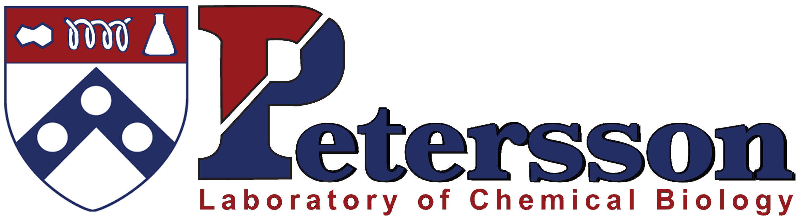

# EJPLab Computational Projects

Repository of all EJP lab computational projects. See appropriate folders for particular projects, which are hyperlinked in the list here.
1. [Shringari, Sumant R., Sam Giannakoulias, John J. Ferrie, and E. James Petersson. "Rosetta custom score functions accurately predict ΔΔ G of mutations at protein–protein interfaces using machine learning." Chemical Communications (2020).](SRS2020/)
2. [Ferrie, John J., and E. James Petersson. "A Unified De Novo Approach for Predicting the Structures of Ordered and Disordered Proteins." The Journal of Physical Chemistry B (2020).](AbInitioVO-and-FastFloppyTail/)
3. [Giannakoulias, S., Shringari, S. R., Liu, C., Phan, H. A. T., Barrett, T. M., Ferrie, J. J., & Petersson, E. J.  "Rosetta Machine Learning Models Accurately Classify Positional Effects of Thioamides on Proteolysis." The Journal of Physical Chemistry B (2020)](RML_ThioClass/)
4. [Sam Giannakoulias, Shringari, Sumant R., John J. Ferrie, and E. James Petersson. "Biomolecular Simulation Based Machine Learning Models Accurately Predict Sites of Tolerability to the Unnatural Amino Acid Acridonylalanine" In preparation](RML_ACD/)
5. [Li, Xinning, Ryann M. Perez, Sam Giannakoulias, and E. James Petersson. "Proteins Need Extra Attention: Improving the Predictive Power of Protein Language Models on Mutational Datasets with Hint Tokens." NAR Genomics and Bioinformatics 7.3 (2025): lqaf128. Editor’s choice.](/HintTokenLearning)
6. [Li, Xinning, Ryann M. Perez, John J. Ferrie, E. James Petersson, and Sam Giannakoulias. "Accurate Prediction of Protein Tertiary and Quaternary Stability Using Fine-Tuned Protein Language Models and Free Energy Perturbation." Int. J. Mol. Sci. 2025, 26, 7125.](/ProteinStability)
7. [Li, Xinning, Ryann M. Perez, Zhude Tu, Robert H. Mach, Sam Giannakoulias, and E. James Petersson. "Machine Learning Prediction of Multiple Distinct High-Affinity Chemotypes for α-Synuclein Fibrils" ChemComm (submitted)](/α-SynucleinBinder)
8. [Ryann M. Perez, Marie Shimogawa, Yanan Chang, Xinning Li, Hoang Anh Phan, Jason Marmorstein, Evan Yanagawa and E. James Petersson. "Large Language Models for Education: An Open-Source Paradigm for Automated Q&A in the Graduate Classroom." Computers and Education: Artificial Intelligence (revise and resubmit).](/TAsk)
9. [Perez, Ryann M., Xinning Li, Sam Giannakoulias, and E. James Petersson. "AggBERT: Best in Class Prediction of Hexapeptide Amyloidogenesis with a Semi-Supervised ProtBERT Model." Journal of Chemical Information and Modeling 63.18 (2023): 5727-5733.](/AmyloidPrediction)
