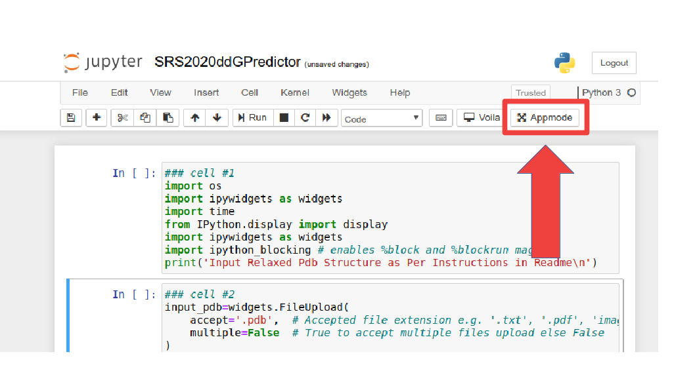
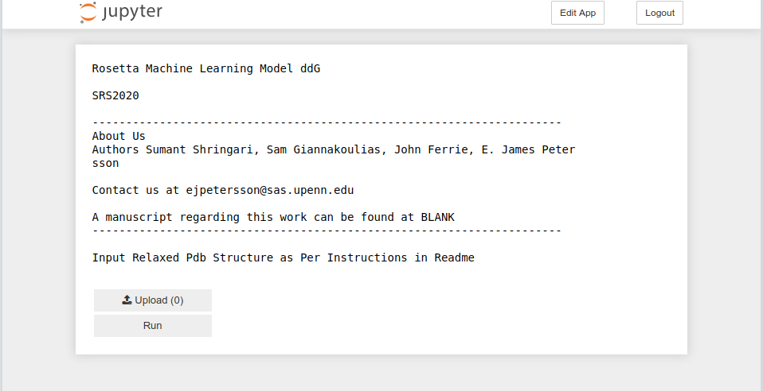

# Demo: How to Run SRS2020ddG Predictor

## Preperation of the System
The following demo assumes that the following operations are done in the conda environment gila.
See __Anaconda folder__ for instruction of installing Anaconda and recieving appropriate conda environment.

## Structure Preperation
Rosetta comes with set of tools to prepare structures that we recommend. To access these tools, get a license for rosetta and pyrosetta. They can be found at tools/protein_tools/scripts/. 
### Clean PDB structures
Non-proteanacious atoms must be removed before Rosetta Simulations. 
```
python clean_pdb.py <pdb> <chain id>
```
### Renumber PDB structures
There are many ways of renumbering the pdb to be from 1 to length of the pdb. It must be continous numbering even across chains.
### Generating Constraint Files
We utilize a atom pair constraints of CA atoms with a harmonic potential with a standard deviation of .5 A with an 8 A cutoff. 
The typical format of this contraint file is AtomPair CA RESNUM1 CA RESNUM2 DIST SD per each line. For example, the first few line of the contraint file can be found below. A python2 script for constraint generation can be found at  tools/protein_tools/scripts/.

```
AtomPair CA 1 CA 2 HARMONIC 3.836 0.5
AtomPair CA 1 CA 3 HARMONIC 7.164 0.5
AtomPair CA 2 CA 3 HARMONIC 3.796 0.5
AtomPair CA 2 CA 4 HARMONIC 6.298 0.5
...
```
More info about constraints can be found at <https://www.rosettacommons.org/docs/latest/rosetta_basics/file_types/constraint-file>
### Relaxing the Structure
The structure must be relaxed with the following options. __Note there is no gurantee that SRS2020 will be efficacious if these exact relax protocol options are not used__. The cartesian relax protocol is with constraints, beta16_cart score function, minimizer option of lbfgs_armijo_nonmonotone,minimize bond angles on and dualspace on. 

We also provide an executable to do the relax. We highly recommend that it is used for those unfamiliar with Rosetta. It can be found at this associated google drive link: 
https://bit.ly/3frW4Dj
```
.\Constrained_Relaxed_BetaNov16 -p input_pdb -cst constraint_file -o pdb_relaxed -db PATHTOROSETTADATABASE
```
For the specific files in this demo, the command is
```
.\Constrained_Relaxed_BetaNov16 -p 1A4Y.pdb -cst 1A4Y_AtomPairConstraints.cst  -o 1A4Y_relaxed.pdb -db /home/sumants/anaconda3/envs/lion/lib/python3.7/site-packages/pyrosetta/database/
```

#### Executable options
1. -p   input pdb       (required)
2. -cst constraint file (required)
2. -o   output pdb name (required)
3. -db  database path   (required)

## Making a resfile
Key to introducing mutations at specfic sites is the resfile. 
To utilize SRS2020, refer __1A4Y_E287A.resfile__ as an example. 

Briefly, each resfile start with NATRO, which specifies that the input native rotamer is preserved as a default. The next line of the resfile is START,followed by an empty line. The next line is the residue number and residue chain with PIKAA followed by desired mutation.
```
NATRO
START

RESNUM RESCHAIN PIKAA DESIRED_MUTATION
```

More info for the resfile can be found at https://www.rosettacommons.org/manuals/archive/rosetta3.4_user_guide/d1/d97/resfiles.html.


## Running SRS2020 ddG Predictor
There are two ways to use SRS2020 ddG predictors. The first way is running through the terminal. The second way is running through the Jupyter App interface. This is more acessible for user with limited terminal experience or those wanting a GUI interface.

Files to run this demo can be downloaded from this link due to github size limits.
https://bit.ly/3d0AggB

Due to liscencing restriction of Rosetta, we cannot distribute the Rosetta database, therefore we recommend obtaining a Rosetta license and within that package there will be an associated database which you should redirect the program to.

### Model Options
Within the models folder, there are two models with their two respective scalers. By default, the model utilized is the one trained with the training regression utilized in the published work. This can be used for other works to benchmark against SRS2020. However, we also provide that the model that is trained on the full dataset. This model should be used for production runs to predict ddG. That option can be utilized with -m and -s option specifiying the realtive path to the model and scaler __(i.e -m models/Full_Dataset_Relaxed_Beta16_Min_Model.sav -s   Full_Dataset_Relaxed_Beta16_Min_Model_Scaler.sav)__.

### Method I: The Executable
#### Accessing executable
It is important that the naming scheme for the resfile is followed. The resfile name must start with the pdb name then followed by underscore with original amino acid, its position, and the mutated amino acid. 

For example, the mutation of residue E 287 on pdb 1A4Y to A 287. The resfile will be named __1A4Y_E287A.resfile__. If one wishes to do multiple mutation, then string the mutations with underscore seperating each other. The resfile will be named __1A4Y_K500G_Y434A_Y437A.resfile__. 
All commands will be run in the terminal.
For the first time setup, one should give permissions to execute the file. On linux, this can easily be done by right clicking the executable and selecting properties and modifying permissions.
```
.\SRS2020_ddG_Predictor -r PDB_OriginalaminoacidResiduenumberMutatationaminoacid.resfile -p pdb_relaxed.pdb -db PATHTOROSETTADATABASE
```
For the specific files in this demo, the command is
```
.\SRS2020_ddG_Predictor -r 1A4Y_E287A.resfile -p 1A4Y_relaxed.pdb -db /home/sumants/anaconda3/envs/gila/lib/python3.7/site-packages/pyrosetta/database/ 
```
##### Executable Options
1. -r     Resfile       (required)
2. -p     Pdb           (required)
3. -db    Database Path (required)
4. -m     Model         (optional)
5. -scal  Scaler        (optional)

### Method II: The Jupyter App
For the first time setup, one should give permissions to execute the file. On linux, this can easily be done by right clicking the executable and selecting properties and modifying permissions. This needs to be done for SRS2020_ddG_Predictor and run_SRS2020_ddG_Predictor_App.

#### Accessing Jupyter App
The aim of this method is to allow a more accesible interface for those with limited terminal experience.

As for method I, it is important that the naming scheme for the resfile is followed. The resfile name must start with the pdb name then followed by underscore with original amino acid, its position, and the mutated amino acid. 

For example, the mutation of residue E 287 on pdb 1A4Y to A 287. The resfile will be named __1A4Y_E287A.resfile__. If one wishes to do multiple mutation, then string the mutations with underscore seperating each other. The resfile will be named __1A4Y_K500G_Y434A_Y437A.resfile__.

#### Running the Jupyter App
```
conda activate gila
.\run_SRS2020_ddG_Predictor_App
```
#### Interface
1. Click on AppMode to generate GUI interface.

2. Follow the instruction given in the GUI. 

3. The process will run and finish with the indication: __Done__.
